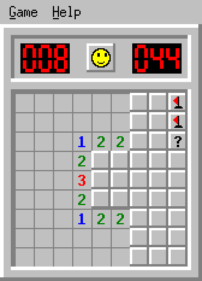

# BombSquad

The minesweeping game that shipped with Windows for twenty years, written
in DBasic and drawn with [Ebitengine](https://ebitengine.org/).

Microsoft calls theirs Minesweeper, so ours is BombSquad — same game,
different badge.



## Build and run

```bash
cd examples/games/bombsquad
dbasic build bombsquad.dbas -o bombsquad
./bombsquad
```

The window is drawn at the original game's size — a Beginner board is only
168 pixels across — and then scaled up. Pass a number to change the scale:

```bash
./bombsquad 1     # original size, tiny on a modern screen
./bombsquad 2     # default
./bombsquad 3     # big
```

## Controls

| Action | What it does |
| --- | --- |
| Left click | Uncover a square |
| Right click | Flag → question mark → clear |
| Both buttons (or middle) | Chord: uncover a number's neighbours |
| Click the smiley | Start a new game |
| F2 | Start a new game |
| F1 | Help |
| Esc | Close a menu or dialog |

**Chording** is the shortcut experienced players live on. Press both buttons
on an uncovered number and, if you have already planted exactly that many
flags around it, every other neighbour opens at once. Get one of those flags
wrong and you will uncover a mine — the original worked the same way.

## What is faithful to the original

- Beginner (9×9, 10 mines), Intermediate (16×16, 40) and Expert (16×30, 99),
  plus a Custom Field dialog with the original's limits (height 9–24,
  width 9–30, at most `(height-1) × (width-1)` mines)
- The mine counter and clock as red 7-segment LED displays, the counter
  going negative when you over-flag
- The smiley reset button: "ooh" while you hold the mouse down, sunglasses
  when you win, X eyes when you lose
- Squares draw pressed-in while held, and a chord presses all nine at once
- The classic number colours: 1 blue, 2 green, 3 red, 4 navy, 5 maroon,
  6 teal, 7 black, 8 grey
- On losing: the mine you stepped on turns red, the rest are uncovered, and
  flags in the wrong place get a red X
- On winning: the remaining mines are flagged for you and the counter hits 0
- **The first click is never a mine** — including the original's lazy way of
  arranging it, which is to pick the mine up and drop it on the first free
  square counting from the top left
- A working menu bar: Game (New, the three levels, Custom, Marks, Color,
  Sound, Best Times, Exit) and Help

## What is new

- **Permanent high score tables** — the best five times for each of the
  three standard difficulties, with names and dates, rather than the single
  best time the original kept. Custom boards are not recorded.

  There is no "reset scores" button. A record you can wipe with one stray
  click is not much of a record. To start over, delete the file below.

  The table shows 12 characters of a name. Type a longer one and the entry
  box says so straight away, and shows exactly what will appear, rather
  than quietly cutting it short after you press OK. The full name is still
  what gets saved to the file.
- Your menu options and the board you were last playing are remembered too.

Everything is stored in one small text file you can read or edit yourself:

```
~/.dbasic-bombsquad.ini
```

- **Sound effects**, generated as square waves at start-up rather than
  loaded from files: a click when squares open, a tick each second, an
  explosion, and a fanfare for winning. Switch them off under Game → Sound.

## Tests

```bash
./run_tests.sh
```

75 checks covering mine laying, neighbour counts, the guaranteed-safe first
click, the uncovering cascade, chording (including chording onto a wrong
flag), the flag/question-mark cycle, the Custom Field limits, the high score
table, the over-long-name warning, and the mapping from a mouse position to
a square or a menu line. They run headlessly — no window — so they work
over SSH and in CI.

`bombsquad_tests.dbas` is not a program on its own; `run_tests.sh` glues it
onto a copy of `bombsquad.dbas` with the game's own `Main` removed, so the
tests can reach the game's internals. Nothing is written into the repository.

## About the source

`bombsquad.dbas` is one file of about 2,900 lines, roughly a quarter of it
comments aimed at someone who has never written a game before. It opens with
a short primer on the handful of DBasic ideas it uses, and it is laid out in
nine numbered sections meant to be read in order:

1. Constants, 2. Types, 3. Sprites, 4. Sound, 5. High scores,
6. Board logic, 7. Menus and input, 8. Drawing, 9. Main.

Things worth a look if you are learning:

- **Section 3** builds every picture in the game once at start-up and then
  stamps copies — including the 7-segment digits and the smiley faces, all
  drawn from plain rectangles.
- **`Reveal`** in section 6 is a flood fill, the same algorithm as the paint
  bucket in a drawing program.
- **`UpdateMouse`** in section 7 is a small state machine, and it is a good
  worked example of why "is the button down?" and "did the button just go
  down?" are two different questions.

Note: do not run `dbasic fmt` on `bombsquad.dbas`. The formatter collapses
indentation inside comments, which flattens the diagrams and the indented
explanations.
