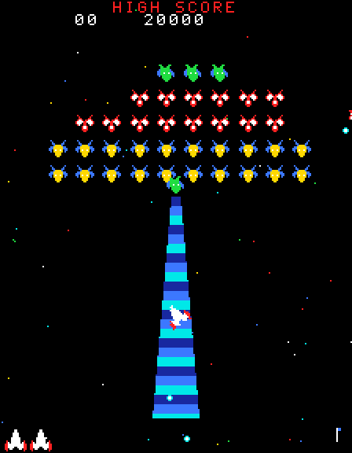

# Gagala

The 1981 Namco arcade game, rebuilt in DBasic and drawn with
[Ebitengine](https://ebitengine.org/).

Namco calls theirs Galaga, so ours is Gagala — same game, different badge.



*Caught in a tractor beam: the boss holds station overhead, the beam opens,
and the fighter spins up it. Shoot that boss down later and you get the
fighter back, flying alongside you.*

## Build and run

```bash
cd examples/games/gagala
dbasic build gagala.dbas -o gagala
./gagala
```

The screen is drawn at the cabinet's own 224×288 — taller than it is wide —
and then scaled up. Pass a number to change the scale:

```bash
./gagala 2     # small
./gagala 3     # default
./gagala 5     # big
```

## Controls

| Key | What it does |
| --- | --- |
| ← → (or A / D) | Move |
| Space or Z | Fire |
| 1 | Insert coin and start |
| P | Pause |
| Esc | Quit |

## What is faithful to the original

- **The 224×288 portrait screen**, three layers of drifting, blinking stars,
  and the 1UP / HIGH SCORE display along the top
- **The 40-strong formation** — 4 Boss Galaga, 16 Butterflies, 20 Bees — in
  the arcade's own layout, swaying side to side and breathing in and out
- **Enemies fly in**, they never just appear: five files of eight, each
  taking a different curving route in before slotting into place
- **Dive attacks** in looping paths, dropping bombs aimed near your fighter
- **Only two of your shots may be in the air at once.** This is the rule
  that shapes how Galaga is played, and the reason the dual fighter matters
- **The tractor beam.** A Boss Galaga comes down, takes station above you,
  and opens a cone of light. Sit in it and your fighter spins up the beam
  and is gone. Shoot that boss down and you get the fighter back — flying
  beside you, firing two shots at a time
- **A Boss Galaga takes two hits**, turning purple after the first
- **Challenging Stages** on stage 3 and every fourth stage after: forty
  aliens fly through in patterns, never shoot, and are worth 10,000 if you
  hit all forty
- **The arcade scoring table**, where what a thing is worth depends on what
  it is doing:

  | | in formation | attacking |
  |---|---|---|
  | Bee | 50 | 100 |
  | Butterfly | 80 | 160 |
  | Boss Galaga | 150 | 400 |
  | …with one escort still flying | | 800 |
  | …with two escorts still flying | | 1600 |

- **Spare fighters** at 20,000 and then every 70,000
- **Stage flags** along the bottom right, worth 50/30/20/10/5/1 stages each
  and always using as few as possible — stage 37 is one 30, one 5 and two 1s
- **The end-of-game report**: shots fired, number of hits, hit-miss ratio

## Tests

```bash
./run_tests.sh
```

71 checks covering the formation layout, the heading and turning arithmetic,
flight paths, docking into formation, the whole scoring table including boss
escorts, spare fighters, the two-shot rule, Challenging Stage timing, the
complete capture → rescue → dual fighter chain, stage flags, and wave setup.
They run headlessly — no window — so they work over SSH and in CI.

`gagala_tests.dbas` is not a program on its own; `run_tests.sh` glues it onto
a copy of `gagala.dbas` with the game's own `Main` removed, so the tests can
reach the game's internals. Nothing is written into the repository.

## About the source

One file, laid out in thirteen numbered sections meant to be read in order,
with about a quarter of it comments aimed at someone who has not written a
game before.

Worth a look if you are learning:

- **Section 6, the flight paths.** The arcade did not store the swoops as
  lists of positions. It stored instructions — "turn three degrees a frame
  for forty frames" — and every loop in the game is drawn by following them.
  A long loop costs no more memory than a short one.
- **`DockToSlot`.** Steering alone cannot bring an alien home: at five
  degrees a frame and nearly two pixels a frame its turning circle is about
  twenty pixels across, so it orbits its own slot for ever. That really was
  the first version, and it quietly stopped the whole game working — no
  alien ever "arrived", so no attack ever launched. There is a test for it.
- **Section 3, the art.** Every sprite and letter is written out as text,
  one character per pixel, and turned into an image at start-up.
- **Section 4, the sound.** No sound files: every noise is generated as
  square waves when the program starts.

The high score is kept in `~/.dbasic-gagala.ini`.

Note: do not run `dbasic fmt` on `gagala.dbas`. The formatter collapses
indentation inside comments, which flattens the diagrams.
